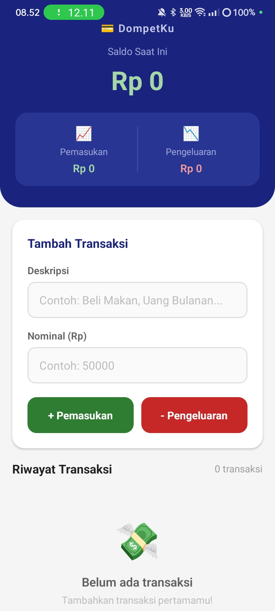
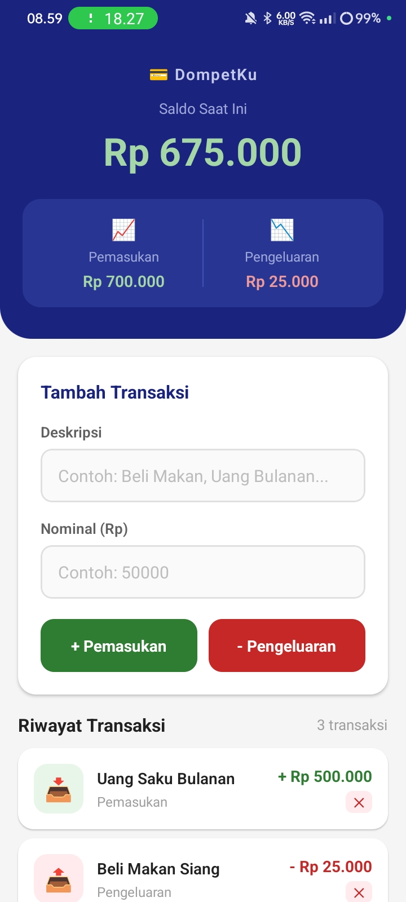
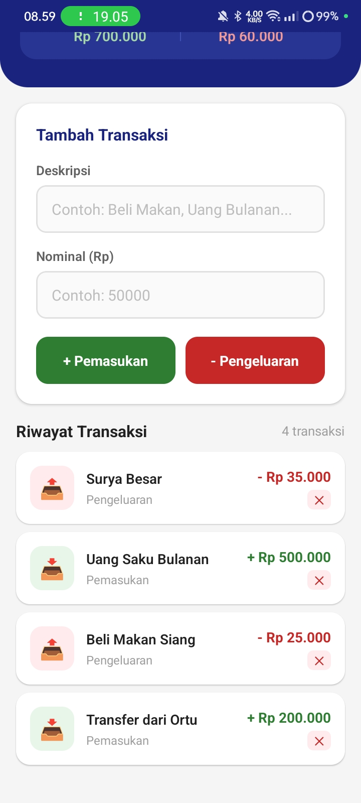

# 💳 DompetKu — Expense Tracker App

> UTS Project — Pemrograman Mobile (React Native) | Sistem Informasi

Aplikasi pencatat keuangan pribadi berbasis React Native (Expo) yang memungkinkan pengguna mencatat **pemasukan** dan **pengeluaran** secara real-time, lengkap dengan perhitungan saldo otomatis.

---

## 📱 Screenshots

| Tampilan Utama | Tambah Transaksi | Riwayat Transaksi |
|:-:|:-:|:-:|
|  |  |  |

---

## ✅ Fitur Aplikasi

| Fitur | Status |
|-------|--------|
| Header Saldo otomatis | ✅ |
| Ringkasan Total Pemasukan & Pengeluaran | ✅ |
| Form Input Deskripsi & Nominal | ✅ |
| Tombol Pemasukan (hijau) & Pengeluaran (merah) | ✅ |
| Validasi input (kosong / bukan angka) | ✅ |
| FlatList Riwayat Transaksi | ✅ |
| Warna nominal HIJAU = masuk, MERAH = keluar | ✅ |
| Hapus transaksi dengan konfirmasi | ✅ |
| Empty state saat belum ada transaksi | ✅ |
| KeyboardAvoidingView (UX mobile) | ✅ |

---

## 🛠️ Teknologi

- **React Native** (Expo SDK)
- **useState** — State management
- **FlatList** — Render daftar transaksi
- **Alert** — Validasi & konfirmasi hapus
- **KeyboardAvoidingView** — UX keyboard

---

## 🧠 Logika State

```js
// Struktur data transaksi
const [transaksi, setTransaksi] = useState([
  { id: '1', ket: 'Uang Saku Bulanan', nominal: 500000, tipe: 'masuk' },
  { id: '2', ket: 'Beli Makan Siang',  nominal: 25000,  tipe: 'keluar' },
]);

// Hitung total saldo dengan reduce()
const totalSaldo = transaksi.reduce((acc, item) => {
  return item.tipe === 'masuk' ? acc + item.nominal : acc - item.nominal;
}, 0);
```

---

## 🚀 Cara Menjalankan

### Menggunakan Expo Snack (Online — Termudah)

Buka (https://snack.expo.dev/@eykel21/dompetku)

### Menggunakan Expo Go (Lokal)

```bash
# 1. Pastikan Node.js & Expo CLI terinstall
npm install -g expo-cli

# 2. Buat project baru
npx create-expo-app DompetKu --template blank@sdk-54
cd DompetKu

# 3. Ganti App.js dengan kode dari repo ini
# 4. Jalankan
npx expo start

# 5. Scan QR Code dengan aplikasi Expo Go di HP
```

---

## 📁 Struktur File

```
DompetKu/
├── App.js          ← Seluruh logika & UI aplikasi
├── README.md       ← Dokumentasi ini
└── screenshots/    ← Screenshot bukti aplikasi berjalan
    ├── home.jpeg
    ├── tambah-transaksi.jpeg
    └── riwayat-transaksi.jpeg
```

---

## 👨‍💻 Dibuat oleh

Nama: [Eykel Agitha Kembaren]
Kelas: [4 Pagi B]
Mata Kuliah: Pemrograman Mobile (React Native)
Universitas Prima Indonesia (UNPRI)
